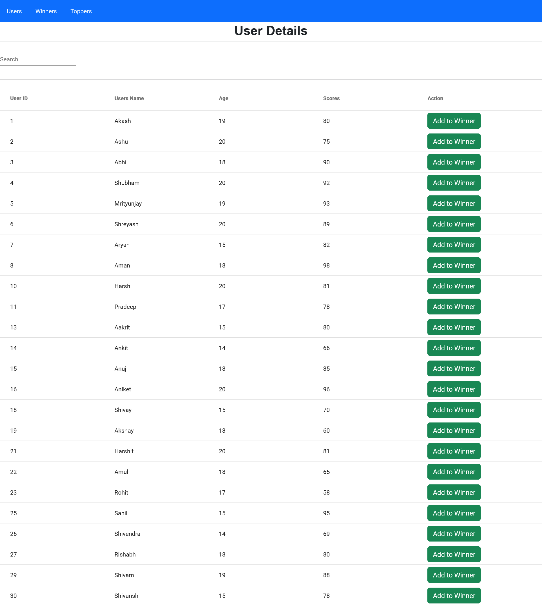
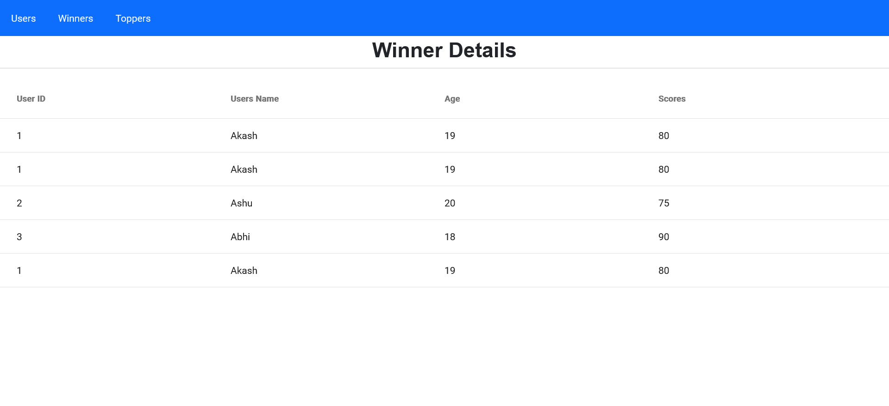
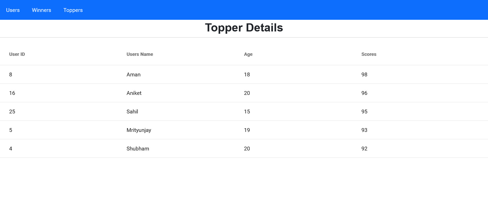

# AngFireProject

This project was generated with [Angular CLI](https://github.com/angular/angular-cli) version 14.2.0.

## Development server

Run `ng serve` for a dev server. Navigate to `http://localhost:4200/`. The application will automatically reload if you change any of the source files.

# Output

<table>
  <tr>
    <td> </td>

    <td></td>
      <td></td>
   </tr> 
 
</table>
